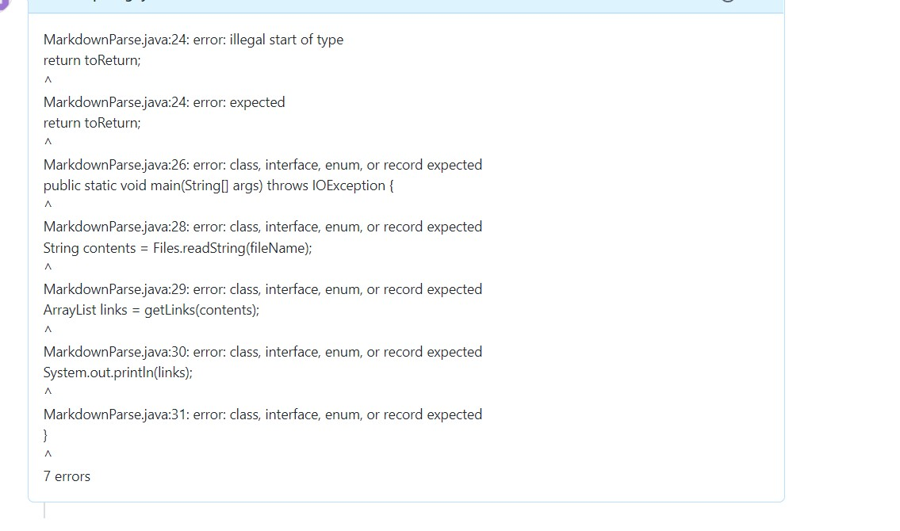

# Code # 1

Link to test file for this failure-inducing input:

[Test File 3](test-file3.md) 

Symptom: 

* The bug is that the program had a neverending loop where the program markdown file isn't a link 
* The sympton is it created index out of bound exception from the bug in the code 
* The symptom index out of bound exception created a error due to the array the failure inducing input neverending looping.
* 
# Code # 2

Link to test file for this failure-inducing input:

[Test File 3](test-file3.md) 
Symptom 

* The bug is that the program had a missing bracket and so the code wasn't able to compile
* The symptom is that the program had a error of wrong syntax in the code
* The failure inducing input was using the testfile.md file in order to do the test which failed and created symptoms in the command line

# Code # 3

Link to test file for this failure-inducing input:

[Test File 1](test-file.md) 
Symptom

* The bug is that the HashMap was expecting a string Array as the value of the HashMap instead of an ArrayList and so the types were wrong
* The symptom was that the program couldn't identify what the variable was due to the types being wrong 
* The failure inducing input was using the testfile1.md file in order to test the Hashmap getting input of the string array which as a result created a error.
